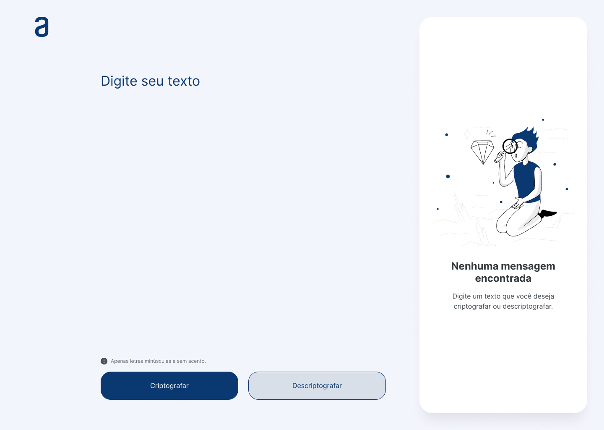

<h1 align="center">Challenge ONE Sprint 01 - Turma 6</h1>

<div align="center"></div>
<div align="center"></div>

<p>
    O objetivo desse Challenge era desenvolver um decodificador de texto utilizando HTML, CSS e Javascript, onde pudesse criptografar um texto e depois descriptografar para o texto original.
</p>

## Tecnologias usadas:
<div align="center">
  
  
  
</div>

## Sobre o desafio
### Descrição


> 🔑 As "chaves" de criptografia que utilizaremos são:

> - A letra "e" é convertida para "enter"
> - A letra "i" é convertida para "imes"
> - A letra "a" é convertida para "ai"
> - A letra "o" é convertida para "ober"
> - A letra "u" é convertida para "ufat"

### Requisitos:
> - Deve funcionar apenas com letras minúsculas.
> - Não devem ser utilizados letras com acentos nem caracteres especiais.
> - Deve ser possível converter uma palavra para a versão criptografada e também retornar uma palavra criptografada para a versão original.

> Por exemplo:
```Js
    "gato" => "gaitober"
    "gaitober" => "gato"
```

> - A página deve ter campos para inserção do texto a ser criptografado ou descriptografado, e a pessoa usuária deve poder escolher entre as duas opções.
> - O resultado deve ser exibido na tela.

## 🔠 Design do Decodificador proposto pelo Challenge
<div align="center">
    
</div>
<p>
    Modelo disponibilizado no Figma, utilizado apenas para fins de inspiração não sendo obrigatorio seguir o mesmo desing.
</p>

## 🔠 Desing criado por mim

### Desktop:
<div align="center">
  
</div>

### Tablet:

<div align="center">
  
</div>


### Mobile:

<div align="center">
  
</div>

## 🔠 Funcionalidades e requisitos

<div align="center">
  
</div>

> - Palavras com letras minúsculas sem acento ➡️ ocorre a criptografia ou descriptografia normalmente. ✅
> - Palavras com letras maiscúlas ➡️ alerta: Apenas letras minúsculas sem acento! ❌
> - Palavras com letras minúsculas mas com acento ➡️ alerta: Não deve ter acentos, caracteres especiais ou números! ❌
> - Apenas caracteres especiais ou números ➡️ alerta: Não deve ter acentos, caracteres especiais ou números! ❌

## 👨🏻‍💻Autor:
### Rafael Santos
[](https://www.linkedin.com/in/raafaelsantos/)
[](https://rafaelsanntos.github.io/Rafa-Dev-Portfolio/)
[](https://github.com/rafaelsanntos)

---
<p align="center">
    Feito com ♥ por Rafael Santos
</p>